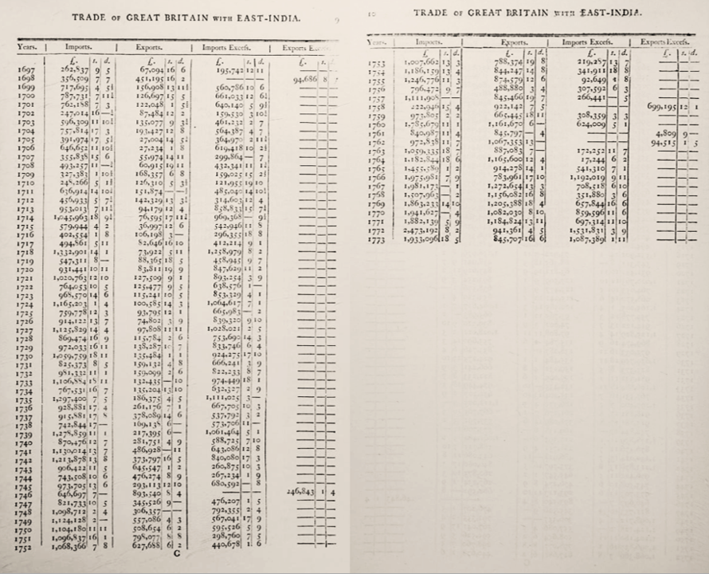
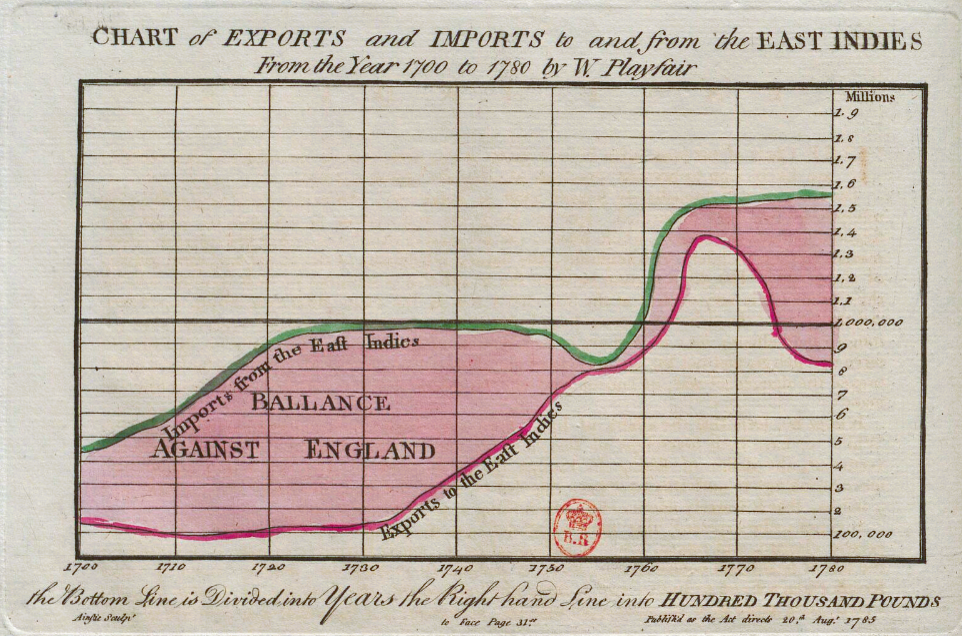

# Introduction

Shortly before the French Revolution, and deeply embedded in the eighteenth century’s fascination with numbers, statistics, and tables, the English writer, engineer, and somewhat disreputable figure [William Playfair](https://en.wikipedia.org/wiki/William_Playfair) published 1786 his [*Commercial and Political Atlas*](https://gallica.bnf.fr/ark:/12148/bpt6k1504263t), a book in which statistical data were, for the first time, represented in graphical form. The atlas marked the birth of the line, bar, and pie charts, and with them, the beginning of data visualization as we know it today.

:::{aside} Between trust and effectiveness

:::{figure}
:label: datavis_development
:align: left

(india_graph)=

(india_table)=

In order to understand the national economy and make effective policy English bureaucrats started analysing trade data in the 18th century. As we can see in [Fig. 1b](../img/india_table_intro.png) from Whitworth's *State of the trade of Great Britain* tables were the common way to present this kind of information.[^whitworth_citation] hier weiter 

[^whitworth_citation]: See [@friendly_history_2021]

See  for the fruit, and  to reference both subfigures.
:::

Nevertheless, it went largely unnoticed and had little to no impact on how quantitative information was represented in thew 19th century. It would take more than 150 years for data visualisation to become part of the informational landscape in books, newspapers, and the media more broadly.

Although Playfair’s graphs have often been discussed in the history of statistics, design, and data visualization, a comprehensive historical study of his sources, intellectual aims, and the possible reasons why his innovative method of conveying quantitative information was long overlooked has yet to be written. [^friendly_citation]

[^friendly_citation]: See [@friendly_history_2021].

In an effort to understand the historical reasons for Playfair’s limited impact, this Jupyter Book examines his works, reconstructs his graphs using Python, explores his historical sources, interpreting the numerical data that underpinned his visualizations. The motivation behind this project is to demonstrate how modern data analysis and visualisation techniques can enhance our understanding of historical sources. 

If you are a historian and less digital humanist, don't worry this Jupyter Book is designed especially for you. The code is explained step by step and serves purely as a tool to explore the subject. If you simply wish to see the results and visualisations, you can press the play button to run the examples. The primary focus is on studying Playfair’s graphs, not on learning to code ;)

If you are a designer or data analyst interested in a more historically informed approach to Playfair, you are equally welcome. Please feel free to reach out with any insights or ideas about analyzing and visualising the data.

